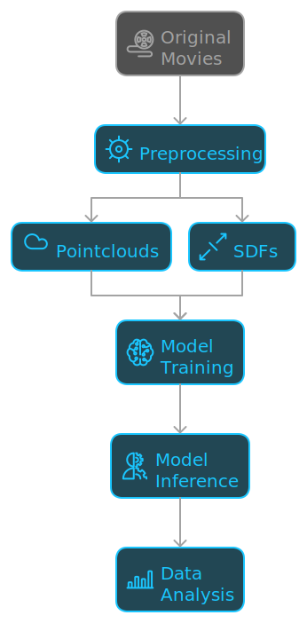

# Benchmarking Representations

Code for training and benchmarking morphology appropriate representation learning methods.

Our analysis is organized as follows.

Continue below for guidance on using these models on your own data.
If you'd like to reproduce this analysis on our data, check out the following documentation.

* [Main usage documentation](./docs/USAGE.md) for reproducing the figures in the paper from the pointclouds and SDFs, including model training and inference.
* [Preprocessing documentation](./subpackages/image_preprocessing/README.md) for generating pointclouds and SDFs from from our input movies. Because this can take a long time, we are publishing the preprocessed data.
* [Development documentation](./docs/DEVELOPMENT.md) for guidance working on the code in this repository.

# Using the models
Coming soon